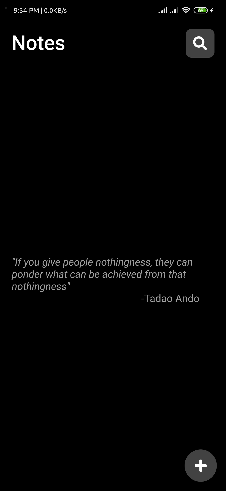
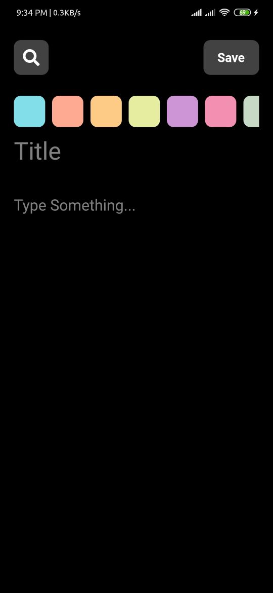
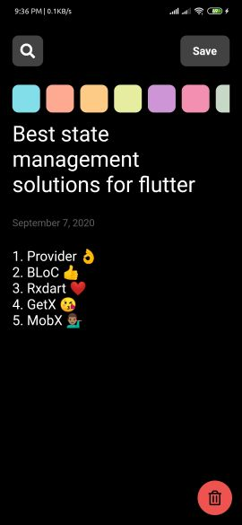
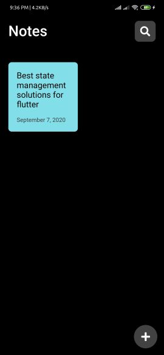
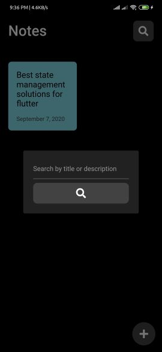

# Let's Note

A Simple Note Taking App Made With Flutter ❤

## Download

Go to the [releases page](https://github.com/ikramhasan/Flutter-Note-App/releases) to download the latest available apk.

## App preview

## Upcoming Features

- Improved search functionality
- Convert Gridview to Staggeredgridview
- Online database

## My Socials

[![Twitter][1.1]][1]
[![Facebook][2.1]][2]
[![Github][3.1]][3]

[1.1]: http://i.imgur.com/tXSoThF.png "twitter icon with padding"
[2.1]: http://i.imgur.com/P3YfQoD.png "facebook icon with padding"
[3.1]: http://i.imgur.com/0o48UoR.png "github icon with padding"

## Thanks

- [Amal](https://dribbble.com/amalvp) for his [Lightweight note app design](https://dribbble.com/shots/11875872-A-simple-and-lightweight-note-app)
- [Flutter](https://flutter.dev) for the great cross platform framework

[1]: http://www.twitter.com/ikramhasandev
[2]: http://www.facebook.com/ihni7/
[3]: https://github.com/ikramhasan/
